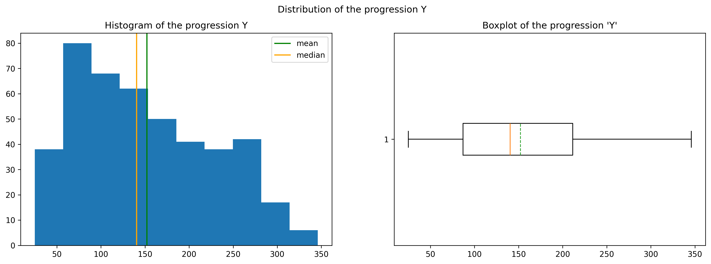
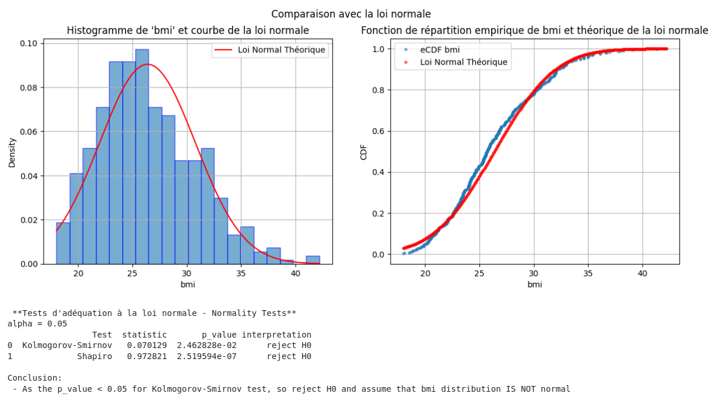
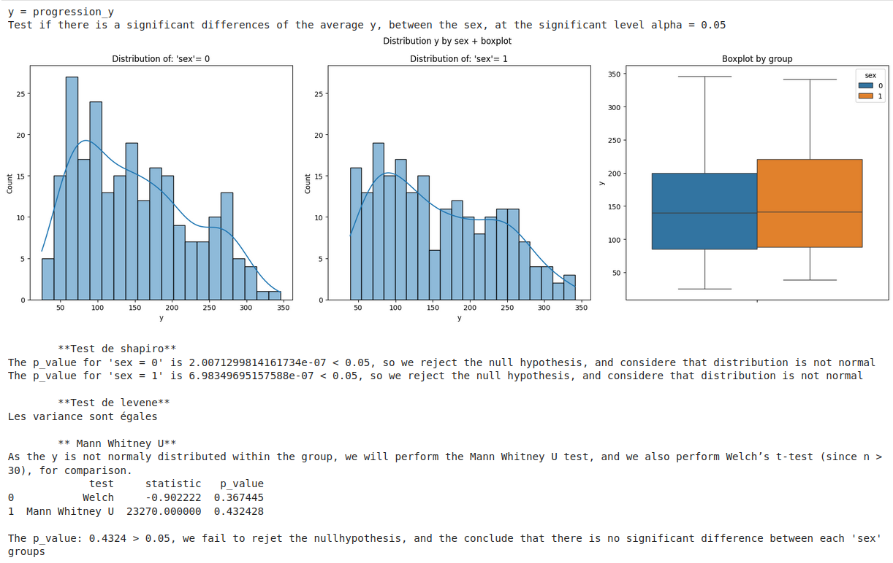
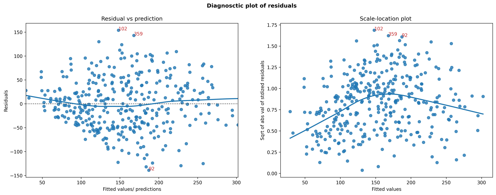

# Introduction

**Statistical and Predictive Modeling of Diabetes Progression — Dataset NCSU**

This project explores the influence of various clinical parameters on the progression of diabetes in patients one year after the start of a study. Using an approach combining descriptive and inferential statistics and modeling, this project aims to illustrate the links between data science and public health issues.

- source: [https://www4.stat.ncsu.edu/~boos/var.select/diabetes.html](https://www4.stat.ncsu.edu/%7Eboos/var.select/diabetes.html)
- dataset: [https://www4.stat.ncsu.edu/~boos/var.select/diabetes.tab.txt](https://www4.stat.ncsu.edu/%7Eboos/var.select/diabetes.tab.txt)

**Fictional context**

The medical team of a clinical research center is interested in the **progression of diabetes in its patients** after one year of follow-up. The Data Science department is asked to:

> 🔍 Identify the factors influencing diabetes progression and estimate the impact of medical parameters to better personalize patient follow-up and prevention strategies.

### Objectives

What clinical factors drive diabetes progression after one year?

**Secondary question**
During the analysis, other secondary questions were asked in order to gain a better understanding of the parameters and dataset.

- Is the proportion of women and men balanced in the sample?
- What is the proportion of obese patients in our population? Can this proportion be extrapolated to the general population? Is it significantly different between the sexes?"
- Can we estimate the average progression after one year in the population?
- Is there a significant difference in bmi, glucose or diabetes progression between women and men?
- Additional questions explored data distributions and potential links between sex, glucose levels, and BMI categories.

---

### Résumé rapide 🇫🇷

Ce projet de data science vise à identifier les facteurs cliniques influençant la progression du diabète après un an, à l’aide de méthodes statistiques inférentielles (test d’hypothèses) et de modélisation prédictive (ex: LightGBM). Les résultats sont accompagnés d’interprétations et d’une validation des hypothèses.

---

### Tables of content
- [1. Statistical Analysis](#1-statistical-analysis)
  - [Exploratory Data Analysis](#exploratory-Data-Analysis)
  - [Distribution of Probability & Normal law](#distribution-of-probability--normal-law)
  - [Sampling, Estimation & Confidence Intervals](#sampling-estimation--confidence-intervals)
  - [Hypothesis testing](#hypothesis-testing)
- [2. Modelisation](#2-modelisation)
  - [Statistical Modeling](#statistical-modelisation)
      - [Multivariate analysis](#multivariate-analysis)
      - [Linear Regression](#linear-regression)
  - [Predictive Modelisation](#predictive-modelisation)
    - [Benchmark Models](#benchmak-model)
    - [Lasso Tuning](#lasso-regression--hyperparameter-tuning)
    - [Feature Importance](#feature-importance)
- [Conclusion](#conclusion---final-remarks)

---

# 1. Statistical Analysis

## Exploratory Data Analysis

We conducted a detailed analysis of 442 diabetic patients to understand the distribution of variables and their relation to disease progression:

- The dataset is balanced between male and female (53% male).
- The average disease progression (target Y) is 152 (±77), with a slight right skew.
- Most patients are overweight (mean BMI = 26.4), and 21.5% are obese (BMI > 30).
- BMI and LTG show the **strongest linear correlations** with disease progression (r ≈ 0.58).
- No substantial sex-related differences were observed for most clinical variables.

These observations support the modeling choices made in the next phase.

| Catégories | IMC (kg/m2) | Risques de complications |
| --- | --- | --- |
| Sous la normale | < 18,5 | Faibles (mais plus grands risques pour d'autres problèmes cliniques) |
| Etendue normale | 18,5 - 24,9 | Moyens |
| Surpoids | 25,0 - 29,9 | Certains risques |
| Obèse | > 30,0 |  |
| Classe I | 30,0 - 34,9 | Modérés |
| Classe II - sévère | 35,0 - 39,9 | Elevés |
| Classe III - morbide | > 40,0 | Très élevés |

*source: https://www.hug.ch/contrepoids/calcul-imc-chez-adulte*

## Distribution of Probability & Normal law

To answer business questions such as:  "*What is the risk of a patient having a BMI over 30?*" or "*Can the male/female distribution be considered balanced?*", it is useful to study the probability laws underlying the variables.

So in this section we have analyzed the observed distributions and compared them with theoretical distributions (normal, Bernoulli...) in order to answer the following questions:

- **Can the male/female distribution be considered balanced?**
- **What is the risk of a patient having a BMI over 30?**
- **Which variables have a normal distribution?** (age, bmi, tc, ldl, ltg, glu)

### Distribution of men and women

- As we saw in the EDA section, 53.2% of the patients in our sample are male, so at first glance our sample could be considered balanced.
However, to be sure, we performed a proportion test (z-test, p = 0.183) and a binomial test. Both tests failed to reject the hypothesis of a 50% balanced distribution.
    - NB: *we used a first approach with the normal distribution and the z-test with n*p_0 > 5, but the results from the bernoulli test are more precise.
- We therefore estimate that the proportion of men in the diabetic population represented here is compatible with a balanced proportion, with a 95% CI of [48.4%; 57.8%].
- This estimate is consistent with worldwide data (≈ 50.4% men at birth, source https://www.ined.fr/fr/tout-savoir-population/memos-demo/faq/plus-hommes-ou-femmes-sur-terre/).

### BMI distribution analysis

We explored the normality of the `bmi` variable using visual and statistical methods .

BMI shows slight right skewness. A log-transformation improves normality. We use `log(bmi)` for tests requiring normality, and raw `bmi` for interpretation.

### Conclusion on the normality of variables

- The Kolmogorov-Smirnov (KS) test proved **more stable** against outliers, while the Shapiro-Wilk test is **very sensitive**, especially for slightly asymmetrical variables.
- Because of this sensitivity, we rely mainly on the **KS-test** to judge the fit to a normal distribution.
- According to these results, the variables `tc`, `ldl` have a distribution **reasonably close to normal**.
- The `glu` variable presents a borderline situation: KS p > 0.05, but **Shapiro p = 0.04**. This suggests a **quasi-normal distribution**, but with caveats.
- The variables `age` and `y` (response) **do not follow a normal distribution** satisfactorily according to both tests.

ℹ️ These conclusions will guide the choice of subsequent statistical methods (parametric or non-parametric tests, modeling).

## Sampling, Estimation & Confidence Intervals

We used statistical estimators and confidence intervals to answer key questions about our diabetic cohort:

- **Obesity rate**: Approximately 21.5% of patients in the sample are obese (BMI > 30). A 95% confidence interval suggests the true population proportion lies between 17.8% and 25.3%.
- **Progression mean**: The average progression of the disease one year after diagnosis is 152.1, with a 95% confidence interval of [144.9 ; 159.3].
- **Progression variability**: The observed standard deviation is 77.1, with a 95% confidence interval of [72.3 ; 82.5].
- **Sample reliability**: Simulations show that even with partial samples of 100 patients, repeated estimations converge to population values. This confirms the reliability of confidence intervals and the law of large numbers.

These results highlight the importance of quantifying uncertainty when generalizing from a sample, and they support the robustness of the indicators used in our modeling.

## Hypothesis testing

### Statistical Testing Summary

We conducted several hypothesis tests to assess differences in glucose levels, BMI, and disease progression (`y`) across sex and BMI groups.

- **BMI is significantly different** between men and women (Welch and Mann–Whitney tests on log(BMI)).
- But we found no obesity prevalence (BMI > 30) between the man and woman (chi2)
- **Glucose levels vary by sex** (t-test), but **disease progression does not** vary by sex(Mann–Whitney).
- **BMI classes significantly affect both glucose and progression**:
    - ANOVA shows that glucose levels vary across BMI categories.
    - Kruskal–Wallis confirms that progression also differs significantly by BMI group.

These insights justify the inclusion of **BMI and glucose as key predictors** in the modeling phase. We ensured statistical validity by checking distribution assumptions and choosing appropriate parametric or non-parametric tests.
NB: In this section we also created the variable bmi_cat2 which is equivalent to the variable bmi_cat with some concatenated groups. This was necessary because some statistical tests require having a minimum of 5 individuals in each class. This was not the case with the initial categories.

**Example - extract of the one test**

**Question**: Does gender influence average disease progression?

- H₀: There is **no difference** in the progression y between men and women.
- H₁: There is a **significant difference**.

→ [Analyse Statistique - Notebook 1](notebooks/01_diabetes_statistical_analysis.ipynb)

“A Mann-Whitney U test showed no significant difference in disease progression between men and women (p = 0.43).”

# 2. Modeling - From Statistical Explanation to Prediction

## Statistical Modelisation

### Multivariate analysis

We first explored pairwise correlations using both Pearson and Spearman methods. The strongest correlations (e.g., `tc` with `ldl`, `tch` with `hdl`) suggested redundancy.

To mitigate multicollinearity (vif factor > 10), we computed Variance Inflation Factors (VIFs), and dropped the most redundant variables (`ldl`, `tch`).

We also tested three representations of BMI (`bmi`, `log(bmi)`, and categorical `bmi_cat2`). The raw BMI showed slightly better correlation and predictive power in a univariate linear regression.

**Final feature set**: `['age', 'sex', 'bmi', 'bp', 'tc', 'hdl', 'ltg', 'glu']` — interpretable and suitable for linear modeling, without multicollinearity.

### Linear Regression

We trained a linear regression model using the `statsmodels` library to investigate the relationships between clinical variables and diabetes progression (`y`).

- Several predictors showed statistically significant effects (e.g., BMI, BP, HDL, LTG), while others (e.g., age, glucose) were not significant.
- The model explains ~52% of the variance in the training set (R² = 0.52).
- NB: removing non-significant variables (by backward elemination) did not lead to improved performance on the train or test set. This emphasizes that statistical significance does not guarantee better predictive performance.
- Assumptions of linear regression were tested. Residual analysis revealed heteroscedasticity, suggesting that the model’s inference on coefficients may not generalize well.
- Performance on the test set was moderate (MAPE ≈ 37.3%).

Although linear regression offers interpretability, its performance is limited in this context. We therefore explored regularized models (Ridge, Lasso) and nonlinear models (LightGBM).

**Extract of the validation of the hypothesis of linear regression**

## Predictive Modelisation

### Benchmak model

We benchmarked multiple models to predict diabetes progression using clinical variables. Simple and multiple linear regressions served as baselines, with regularized models (Ridge, Lasso) offering slight improvements. Ensemble methods like Random Forest and LightGBM performed better on training sets but dramaticaly overfit, likely due to the limited dataset size (442 samples). The poor generalization of the LightGBM (RMSE CV ≈ 60) suggests this model is too complex for the size and structure of the dataset. 

Among all models tested, **Lasso regression achieves the best cross-validated RMSE (55.51).** And ****unlike tree-based models like Random Forest and LightGBM, Lasso maintains good generalization without significant overfitting.

Therefore, we selected **Lasso** for further tuning and final evaluation.

NB: The benchmark was automated with the `fit_and_evaluate_model_with_cv` function, to improve reproducibility.

|  | **model** | **RMSE Train** | **CV Mean RMSE** | **CV Std RMSE** |
| --- | --- | --- | --- | --- |
| **0** | Simple Linear Regression | 62.082 | 62.340 | 3.084 |
| **1** | Linear Regression | 53.851 | 55.681 | 3.464 |
| **2** | Ridge | 53.850 | 55.670 | 3.450 |
| **3** | Lasso | 53.930 | 55.510 | 3.200 |
| **4** | LightGBM Regressor | 22.547 | 60.288 | 3.439 |
| **5** | Random Forest | 22.008 | 58.271 | 2.482 |

### Lasso Regression — Hyperparameter Tuning

We optimized Lasso using `GridSearchCV` over alpha, tolerance, and selection strategy.

- Best alpha: **1.0** (same as default).
- CV RMSE = 55.56 (no gain over default Lasso).
- On test set: **RMSE = 53.09**, **R² = 0.46**

This results confirm a the moderate predictive power. 

### Feature Importance

To interpret the final model (Lasso), we explored feature importance using three complementary methods: model coefficients, permutation importance, and SHAP values.

All methods consistently highlight that `bmi`, `ltg` and `bp` are the strongest predictors of diabetes progression, while variables like `hdl`, `sex`, and `tc` have a negative or lesser impact. This enhances the model's transparency and clinical interpretability.

# Conclusion - Final Remarks

This project demonstrates how classical statistical modeling and modern machine learning can complement each other to analyze clinical data.

- Statistical modeling helped identify significant variables and test hypotheses.
- Machine learning methods (especially Lasso regression) allowed us to build a predictive model with reasonable accuracy and good interpretability.

Despite the moderate predictive performance (RMSE ≈ 53, R² ≈ 0.46), the insights gained are clinically relevant: **BMI, LTG, and BP** are key predictors of diabetes progression.

Next steps could include:

- Increasing sample size to reduce overfitting in non-linear models
- Testing interactions between variables
- Exploring time series or longitudinal modeling if temporal data is available

> 🩺 This project bridges statistical rigor and real-world healthcare questions
